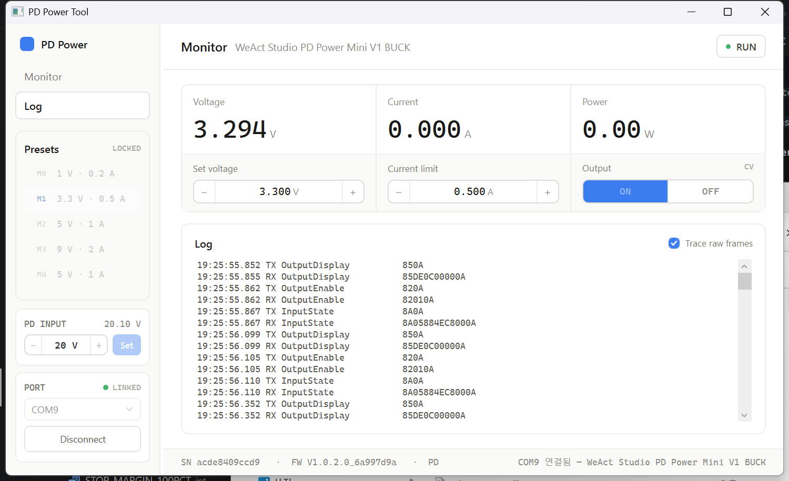
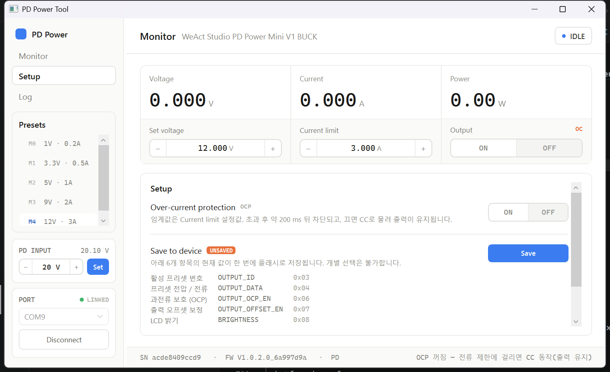

# WeactPD_PowerV1 — WeAct PD Power Mini V1 (Buck) PC 제어 프로그램

[WeAct Studio PD Power Mini V1 BUCK](https://github.com/WeActStudio/WeActStudio.PDPowerMiniV1-Buck) 장치를 PC에서 제어/모니터링하는 **Windows 10 C# (WPF)** 데스크톱 애플리케이션 개발 프로젝트.

## 1. 프로젝트 개요

| 항목 | 내용 |
|---|---|
| 대상 장치 | WeAct Studio PD Power Mini V1 BUCK (출력 1–20 V / 0.05–3 A) |
| 통신 방식 | USB CDC 가상 시리얼 포트 (기본) / UART (DP→TX, DM→RX, 3.3 V, CRC8) |
| 개발 환경 | Windows 10/11, Visual Studio 2022, .NET 8 (WPF) |
| 시리얼 | `System.IO.Ports.SerialPort` |
| 차트 | LiveCharts2 또는 ScottPlot (듀얼 Y축: 전압/전류) |
| 디자인 원본 | [`GUI/design/PD Power Tool Redesign.dc.html`](GUI/design/PD%20Power%20Tool%20Redesign.dc.html), 구현 스펙: [`GUI/design/CSHARP-SPEC.md`](GUI/design/CSHARP-SPEC.md) |
| 프로토콜 원본 | [`docs/protocol/`](docs/protocol/) (제조사 xlsx 2종 + Python 예제) |

### 실장비 검증 (2026-07-27, COM9 / USB CDC)

CLI(`selftest`)와 WPF 앱 양쪽에서 아래를 실제로 확인:

```
장치명    : WeAct Studio PD Power Mini V1 BUCK
펌웨어    : V1.0.2.0_6a997d9a
시리얼    : acde8409ccd9
입력      : PD 20.111 V (PD 요청 20.0 V)
활성설정  : M4 = 5.000 V / 1.000 A
프리셋    : M0 1.0V/0.2A · M1 3.3V/0.5A · M2 5.0V/1.0A · M3 9.0V/2.0A · M4 5.0V/1.0A
```

읽기 계열 명령(WHO_AM_I, VERSION, SERIAL_NUM, OUTPUT_STATE, OUTPUT_ID, OUTPUT_DATA,
OUTPUT_DISPLAY, OCP_EN, OFFSET_EN, BRIGHTNESS, INPUT_STATE)은 전부 실장비 응답 확인 완료.
쓰기 계열은 출력 단자에 전압이 인가되므로 미검증 — `PdPower.Cli` 로 직접 확인할 수 있다.

## 2. 통신 프로토콜 요약

### 2.1 공통 사항

- 명령 1바이트가 프레임 선두. **읽기 명령은 `0x80` 비트를 OR** 한다 (예: OUTPUT_DATA 쓰기 `0x04`, 읽기 `0x84`).
- **USB CDC**: 프레임 종단 바이트 `0x0A`. 보레이트 무관 (가상 COM).
- **UART**: 종단 대신 **CRC8** 1바이트 (다항식 `0x31`, 초기값 `0xFF`, MSB-first bit 단위 처리). 보레이트 9600–460800 (장치 설정).
- 멀티바이트 값은 **리틀 엔디언** (`l8` = 하위, `h8` = 상위).
- 장치 응답도 동일 구조: `[cmd(0x80|x)] [payload...] [0x0A 또는 crc8]`.
- 문자열 응답(WHO_AM_I/VERSION/SERIAL)은 USB CDC에서 `[cmd][ascii...][0x0A]`, UART에서는 `[cmd][length][ascii...][crc8]`.

### 2.2 쓰기 명령 (PC → 장치)

| 명령 | Head | 페이로드 | 비고 |
|---|---|---|---|
| OUTPUT_EN | `0x02` | `x` | **`1=enable`** (실측 확정). xlsx의 `0=enable` 주석은 오류 — 아래 참조 |
| OUTPUT_ID | `0x03` | `x` | 프리셋 그룹 M0–M4 (0–4) |
| OUTPUT_DATA | `0x04` | `id, v_l8, v_h8, i_l8, i_h8` | 전압 mV, 전류 mA |
| OUTPUT_OCP_EN | `0x06` | `x` | 과전류 보호 |
| OUTPUT_OFFSET_EN | `0x07` | `x` | 오프셋 보정 |
| BRIGHTNESS | `0x08` | `x` | 1–100 |
| OUTPUT_DISCHARGE_EN | `0x09` | `x` | 방전 기능 |
| INPUT_PD_VOLTAGE | `0x0A` | `v_l8, v_h8` | 단위 0.1 V, 8 V 이상. 출력 OFF & 출력전압 < 5 V 조건에서만 적용 |
| SYSTEM_RESET | `0x40` | — | |
| SYSTEM_CONFIG_SAVE | `0x44` | — | 아래 6가지를 한 번에 플래시 저장 (개별 선택 불가) |
| SYSTEM_FACTORY_RESET | `0x45` | — | |

> 쓰기 명령 페이로드 값들은 **휘발성(Volatile)** — 전원 재인가 시 소실. 유지하려면 `SYSTEM_CONFIG_SAVE`(0x44) 필요 (GUI Setup 화면의 "Save" 버튼).

### SYSTEM_CONFIG_SAVE(`0x44`) 저장 대상

| 항목 | 명령 | 코드 |
|---|---|---|
| 활성 프리셋 번호 | `OUTPUT_ID` | `0x03` |
| 프리셋 전압 / 전류 | `OUTPUT_DATA` | `0x04` |
| 과전류 보호 (OCP) | `OUTPUT_OCP_EN` | `0x06` |
| 출력 오프셋 보정 | `OUTPUT_OFFSET_EN` | `0x07` |
| LCD 밝기 | `BRIGHTNESS` | `0x08` |
| PD 요청 전압 | `INPUT_PD_VOLTAGE` | `0x0A` |

**저장 대상이 아닌 것:**

- `OUTPUT_EN`(`0x02`) — 출력 on/off. 전원 재인가 시 항상 OFF로 시작한다(안전 동작).
- `OUTPUT_DISCHARGE_EN`(`0x09`) — 휘발성인데 저장 목록에도 없어서 **영구 설정이 불가능하다.**
  매번 연결 후 다시 보내야 한다.
- `SYSTEM_LCD_PANEL_TYPE`(`0x46`) — 반대 경우. **비휘발성**이라 `0x44` 없이 즉시 기록된다.

플래시에 저장된 값을 되읽는 명령은 없다. `READ_OUTPUT_DATA` 등은 항상 현재 유효값(RAM)을 준다.
그래서 GUI 의 `UNSAVED` 표시는 **연결 이후 앱이 만든 변경만** 추적한다 — 장치 노브로 바꾼 값이나
연결 전 상태는 알 수 없다.

### 2.3 읽기 명령 (PC → 장치 → 응답)

| 명령 | Head | 응답 페이로드 | 비고 |
|---|---|---|---|
| WHO_AM_I | `0x81` | `info(ascii)` | 장치명 |
| READ_OUTPUT_STATE | `0x82` | `x` | bit0: output en, bit2-1: 01=CC, 10=OC, 00=정상(CV) |
| READ_OUTPUT_ID | `0x83` | `x` | 현재 프리셋 ID |
| READ_OUTPUT_DATA | `0x84` | `id, v_l8, v_h8, i_l8, i_h8` | 요청 시 `id` 1바이트 포함하여 전송 |
| READ_OUTPUT_DISPLAY | `0x85` | `v_l8, v_h8, i_l8, i_h8` | **실측** 전압(mV)/전류(mA) — 모니터링 폴링용 |
| READ_OUTPUT_OCP_EN | `0x86` | `x` | |
| READ_OUTPUT_OFFSET_EN | `0x87` | `x` | |
| READ_BRIGHTNESS | `0x88` | `x` | |
| READ_INPUT_STATE | `0x8A` | `state, v_l8, v_h8, pv_l8, pv_h8` | state 코드 아래 표, v=입력전압(mV), pv=PD요청전압(0.1 V) |
| READ_SYSTEM_VERSION | `0xC2` | `version(ascii)` | |
| READ_SYSTEM_SERIAL_NUM | `0xC3` | `serial(ascii)` | |

**INPUT_STATE state 코드**: 0=WAIT, 1=WAIT_PD_OK, 2=WAIT_QC_OK, 3=ERR, 4=QC, 5=PD, 6=DC

### 2.4 CRC8 (UART 모드 전용) — C# 구현

```csharp
public static byte Crc8(ReadOnlySpan<byte> data)
{
    byte crc = 0xFF;                    // 초기값
    foreach (byte b in data)
    {
        crc ^= b;
        for (int i = 0; i < 8; i++)
            crc = (byte)((crc & 0x80) != 0 ? (crc << 1) ^ 0x31 : crc << 1);
    }
    return crc;
}
```

## 3. GUI 설계


목표 GUI는 제조사 예제 툴(PD Power Communication Tool v0.1.3)이 아니라 **자체 디자인안**을 따른다.
치수·색상의 최종 근거는 목업 HTML [`GUI/design/PD Power Tool Redesign.dc.html`](GUI/design/PD%20Power%20Tool%20Redesign.dc.html)
이고, 요약 스펙은 [`GUI/design/CSHARP-SPEC.md`](GUI/design/CSHARP-SPEC.md) 다.
**요약 스펙만 보고 구현하면 팔레트는 맞아도 구조가 틀어진다** — 반드시 목업을 렌더링해서 확인할 것. 핵심:

- 창 1000×610, 좌측 레일(접이식 196↔56 px) + 우측 메인 2단 레이아웃
- **좌측 레일**: Monitor/Log 내비, 프리셋 M0–M4 카드(1클릭 적용·더블클릭 편집·출력 중 잠금), PD INPUT 카드(5/9/12/15/20 V), PORT 카드(COM 선택·연결)
- **메인**: 측정 스트립 3열(Voltage/Current/Power + Set 스테퍼·Output ON/OFF·CV/CC 배지), 듀얼축 Trend 차트, 푸터(SN·FW·입력 정보)
- 스테퍼: 휠 ±1 / Ctrl+휠 ±0.1, 범위 1–20 V / 0–3 A, 변경 즉시 장치 반영
- Trend 시간 범위 1m / 5m / 1h, 측정 주기는 Setup 에서 10 ms 단위로 조절 (기본 250 ms)

### 디자인 재현에서 놓치기 쉬운 것들

목업의 "느낌"은 대부분 아래 구조에서 나온다. WPF 기본 컨트롤을 그대로 두면 Aero 시절 크롬이
플랫 카드와 섞여 전체가 촌스러워지므로, `Themes/Theme.xaml` 에서 ComboBox·CheckBox·ListBox까지
전부 템플릿을 교체했다.

| 항목 | 올바른 구조 |
|---|---|
| 창 | 외곽 여백 0. 레일은 `#FAFAF9` 면 + 오른쪽 헤어라인, 헤더/푸터도 헤어라인으로 구분 |
| 측정 셀 | 흰 상단(값) + `#FAFAF9` 하단(제어)을 `#F2F2F0` 헤어라인으로 나눈 2단 |
| 값 표기 | 32 px 모노 숫자 + 13 px 회색 단위, **베이스라인 정렬** (캡션에 단위를 넣지 않는다) |
| 스테퍼 | `[− │ 값 │ +]` 를 테두리 하나(radius 7)로 묶고 내부만 헤어라인 |
| 출력 | 토글 버튼이 아니라 `ON│OFF` 세그먼트, 활성 칸만 액센트로 채움 |
| 배지 | `CV`/`CC`/`OC` 2글자 (열거형 이름 그대로 쓰면 길어서 깨진다) |
| Trend | 탭 컨트롤이 아니라 카드 안 섹션 — 제목 + 범례 + 도구 버튼을 한 줄에 |
| 밀도 | 본문 11–13 px. 기본 WPF 크기를 쓰면 계기판이 아니라 웹 폼처럼 보인다 |

**스타일에서 색을 바꿀 버튼은 템플릿이 `Background`·`BorderBrush` 를 `TemplateBinding` 으로
받아야 한다.** 하드코딩하면 호출부 `DataTrigger` 가 배경은 못 바꾸고 글자색만 바꿔서 글자가
사라진다 (nav 버튼·`GhostButton` 에서 각각 한 번씩 겪었다). 그리고 호버는 배경색이 아니라
투명도로 표현해야 색을 덮어쓴 상태에서도 깨지지 않는다.

Trend 차트는 [`Controls/TrendChart.cs`](src/PdPower.App/Controls/TrendChart.cs) 에서 직접 그린다.
x축은 인덱스가 아니라 **시각**이고, 점이 화면 폭보다 많으면 픽셀 열마다 최소/최대를 뽑아
수직선으로 그린다(min/max 데시메이션). 1시간 창의 14,400점을 균등 샘플링으로 700 px 에 넣으면
스파이크가 사라지는데, 전원 장치 파형에서는 그 스파이크가 정작 보고 싶은 것이다.

### Trend 기능

| 기능 | 동작 |
|---|---|
| `1m` `5m` `1h` | 표시 구간. 저장 간격이 따라 조정된다 |
| `Fit` | Y축을 0부터가 아니라 데이터 범위에 맞춘다 — 12.00 V 부근 리플 관찰용 |
| `Freeze` | 화면을 그 시점에 고정. **수집은 계속되므로 데이터를 잃지 않는다** |
| `CSV` | 보이는 구간을 그대로 내보낸다 (정지 중이면 정지된 구간) |
| 커서 | 마우스를 올리면 가장 가까운 샘플의 시각·V·A·W·상태를 읽어준다 |
| 상태 띠 | 플롯 아래 얇은 띠에 CV/CC/OC·출력 on/off 를 시간순으로 칠한다 |
| 통계 줄 | 보이는 구간의 V·A·W 각 min/avg/max |

`Freeze` 는 폴링을 멈추는 게 아니라 잘라낸 창 한 장(`MeasurementWindow`)을 붙잡는 방식이다.
링 버퍼가 뒤에서 덮여도 정지 화면이 흔들리지 않고, 해제하면 라이브로 바로 돌아온다.

CSV 열: `timestamp,volts,amps,watts,regulation,output_enabled` (타임스탬프는 ISO 8601).





## 4. 솔루션 구조

```
WeactPD_PowerV1/
├─ WeactPD_PowerV1.sln
├─ README.md                      ← 본 문서
├─ docs/protocol/                 ← 제조사 프로토콜 원본 (UART/USB xlsx, Python 예제)
├─ GUI/design/                    ← 목표 GUI 디자인안 (HTML 목업, C# 구현 스펙, 스크린샷)
├─ src/
│  ├─ PdPower.Core/               ← 프로토콜 라이브러리 (net8.0)
│  │  ├─ Protocol/
│  │  │  ├─ PdCommand.cs          ←   명령 코드 enum
│  │  │  ├─ ProtocolMode.cs       ←   UsbCdc / Uart
│  │  │  ├─ Crc8.cs               ←   CRC-8 (0x31, init 0xFF)
│  │  │  └─ Frame.cs              ←   프레임 인코딩/디코딩, 응답 길이표
│  │  ├─ Models/                  ←   DeviceInfo, OutputStatus, InputStatus,
│  │  │                           ←   MeasurementHistory (시간 기준 링 버퍼)
│  │  ├─ PdPowerDevice.cs         ←   장치 API (SerialPort 요청/응답)
│  │  └─ PdPowerException.cs
│  ├─ PdPower.Cli/                ← 실장비 검증 콘솔 도구 (net8.0)
│  └─ PdPower.App/                ← WPF GUI (net8.0-windows, MVVM)
│     ├─ Themes/Theme.xaml        ←   팔레트 + 컨트롤 템플릿 전체 교체
│     ├─ Controls/TrendChart.cs   ←   듀얼축 시계열 차트 (직접 렌더링)
│     ├─ ViewModels/MainViewModel.cs
│     ├─ Converters.cs
│     └─ MainWindow.xaml
└─ tests/PdPower.Core.Tests/      ← xUnit — CRC8/프레임 검증 26개
```

### 빌드 · 실행

```bash
dotnet build WeactPD_PowerV1.sln
```

```bash
dotnet test tests/PdPower.Core.Tests/PdPower.Core.Tests.csproj
```

CLI로 실장비 확인 (읽기 전용):

```bash
dotnet run --project src/PdPower.Cli -- --port COM9 selftest
```

WPF 앱 실행:

```bash
dotnet run --project src/PdPower.App
```

### 구현 시 주의점

- `Frame.ResponseLength()` 로 응답 길이를 고정해 프레임을 잘라낸다. **종단 바이트(0x0A) 탐색만으로는
  프레임을 나눌 수 없다** — 예를 들어 2570 mV(`0x0A0A`)처럼 페이로드에 0x0A가 들어갈 수 있다.
  ASCII 응답(WHO_AM_I/VERSION/SERIAL)만 종단 탐색을 쓴다.
- 요청 직전에 수신 버퍼를 비워(`DiscardInBuffer`) 프레임 동기를 잡는다.
- `PdPowerDevice.FrameExchanged` 이벤트는 **스레드 풀에서 발생**한다. UI 컬렉션을 갱신하려면
  구독자가 디스패처로 마샬링해야 한다 (안 하면 `NotSupportedException`).
- 슬라이더처럼 값이 연속으로 바뀌는 컨트롤은 **디바운스가 필수**다. 밝기를 그대로 바인딩하면
  드래그 한 번에 수백 개 프레임이 나간다. `MainViewModel` 은 250 ms 모아서 한 번만 쓴다.
  장치에서 되읽어 슬라이더를 맞출 때는 억제 플래그로 쓰기 루프를 끊는다.
- `READ_INPUT_STATE`(0x8A)는 PD Power Mini V1 펌웨어 **v1.0.2.0 이상**에서만 지원 —
  실패를 정상 흐름으로 처리한다.

## 5. 개발 로드맵

- [x] **PdPower.Core**: 프로토콜 라이브러리
  - [x] 프레임 빌더/파서 (USB CDC `0x0A` 종단 + UART CRC8 모드)
  - [x] 명령 API (enable, preset, data set/get, display, input state, 보호 설정, save 등)
  - [x] 요청/응답 직렬화 + 타임아웃, 연결 해제 감지
  - [x] 단위 테스트 — 문서의 CRC8 정답값 15개로 검증
  - [ ] SYSTEM_FACTORY_DATA(0x47) 캘리브레이션 값 읽기/쓰기
- [x] **PdPower.Cli**: 실장비 검증 도구 (읽기 명령 전체 확인 완료)
- [x] **PdPower.App (WPF, MVVM)**
  - [x] 목업 기준 레이아웃 — 여백 0, 톤 있는 레일, 2단 측정 셀, 통합 스테퍼 알약
  - [x] 기본 컨트롤 템플릿 전체 교체 (ComboBox·CheckBox·ListBox·버튼)
  - [x] 레일 내 Monitor/Log 내비, 프리셋 M0–M4 (1클릭 적용, 출력 중 잠금)
  - [x] PD INPUT 스테퍼, PORT 카드 (드롭다운 열 때 포트 자동 갱신)
  - [x] 250 ms 폴링 → 실측 V/A/W, CV/CC/OC 배지, RUN/IDLE/OFFLINE 칩
  - [x] `ON│OFF` 세그먼트 출력 제어
  - [x] 스테퍼 (−/+ 버튼, 휠 ±1 / Ctrl+휠 ±0.1)
  - [x] 듀얼축 Trend 차트 + 오토스케일, 시간 범위 1m/5m/1h
  - [x] Trend 계측 기능 — 정지, 커서 읽기, CSV 내보내기, Fit 스케일, 상태 띠, 창 통계
  - [x] 백그라운드 폴링 루프 + 60 ms 화면 갱신 (10 ms 주기에서도 UI 유지)
  - [x] 측정 주기(10 ms 단위) · 상태 읽기 배수 설정
  - [x] Log 화면 (원시 프레임 트레이스 토글)
  - [x] Setup 화면 — OCP on/off, LCD 밝기 슬라이더, 설정 저장(`0x44`) + 미저장 표시
  - [x] USB 단절 시 자동 재접속 대기 (아래 참조)
  - [ ] Setup 나머지: 오프셋 보정, 방전(읽기 명령 없음에 유의)
  - [ ] Setup 유지보수: 재부팅(`0x40`), 공장 초기화(`0x45`) — `0xC7` 교정값 백업 기능을 먼저 붙일 것
  - [ ] 미연결 시 CV 배지가 뜨는 문제 (기본값이 `CV` 라 장치 없이도 표시됨)
  - [ ] 레일 56 px 아이콘 모드 접힘
  - [ ] 프리셋 더블클릭 인라인 편집
  - [ ] 앱 설정 저장 (측정 주기 등이 재시작하면 기본값으로 돌아간다)
  - [ ] 트리거 버스트 캡처 — 조건(상태 ≠ CV) 발생 시 전후 구간만 최고 속도로 담고 자동 정지.
        상시 10 ms 가 CPU 29 %를 먹는 문제를 피하면서 트립 파형을 제대로 잡는 방법
  - [ ] 전력(W) 시리즈 — 3번째 축을 어디에 둘지 결정 필요
- [ ] 설치본 패키징

## 6. 참고 링크

- 제조사 저장소: <https://github.com/WeActStudio/WeActStudio.PDPowerMiniV1-Buck>
- 프로토콜 Python 예제: [`docs/protocol/com_pdpower.py`](docs/protocol/com_pdpower.py)

## 7. 주의 사항

- `INPUT_PD_VOLTAGE` 변경은 **출력 OFF + 출력전압 5 V 미만**일 때만 적용됨
- 3 A 연속 출력은 방열 보강 필요 (2 A까지는 상시 가능)
- **`*_EN` 계열은 `1=enable` 이다 (실측 확정).** xlsx 표는 `OUTPUT_EN`·`OCP_EN`·`OFFSET_EN`·
  `DISCHARGE_EN` 네 명령에 똑같이 "x=0,enable;x=1,disable" 주석을 달아놨는데 **틀렸다.**
  근거: ① 벤더 README가 OCP를 `0=Disabled, 1=Enabled`로 기술 ② 벤더 Python 예제가 `1=enable`
  ③ COM9 실측 — `0x01`을 보내면 출력이 실제로 켜지고 OCP 보호가 발동했다.
  `PdPowerDevice.OutputEnableOnValue` 기본값 `0x01`이 맞다.
- 프리셋·PD 전압 등 쓰기 값은 휘발성 — `SYSTEM_CONFIG_SAVE` 없이는 전원 재인가 시 소실
- UART 직결 시 3.3 V 레벨, 외부 UART 칩은 역전류 보호 필요

## 8. 폴링 성능 실측 (COM9, `PdPower.Cli bench 300`)

GUI 폴링이 매 주기에 쓰는 읽기 명령 3개의 왕복 시간. 단위 ms.

| 명령 | 최소 | 평균 | p95 | 최대 |
|---|---|---|---|---|
| `READ_OUTPUT_DISPLAY` `0x85` | 0.14 | 0.23 | 0.30 | 0.67 |
| `READ_OUTPUT_STATE` `0x82` | 0.15 | 0.31 | 0.30 | 26.09 |
| `READ_INPUT_STATE` `0x8A` | 0.16 | 0.29 | 0.31 | 17.67 |
| **폴링 1주기 합계** | **0.48** | **0.83** | **0.85** | **26.58** |

**250 ms 주기 점유율 0.3 %** — 300배 여유가 있다. USB CDC 데이터 엔드포인트는 벌크라서
1 ms 프레임 스케줄에 묶이지 않고, 그래서 왕복이 서브밀리초로 나온다.

주기를 줄일 때 실제로 걸리는 제약은 전송이 아니다:

- **장치 표시값 갱신 주기.** 0.5 ms 간격으로 읽으면 같은 값이 중복돼 나온다.
  10 ms 아래로는 새 데이터가 없다.
- **드물게 20~30 ms 지연이 튄다** (p95는 0.85 ms인데 최대 26.6 ms). 주기를 30 ms 미만으로
  잡으면 간헐적으로 주기가 겹칠 수 있다. `PollAsync` 의 재진입 가드가 그 틱을 건너뛰므로
  안전하지만, 실효 주기는 흔들린다.
- **프레임 트레이스를 켜면 주기가 15배 늘어난다** (0.8 ms → 11~15 ms). 디스패처 마샬링과
  `ObservableCollection` 갱신 비용이다. 기본이 꺼져 있는 이유이고, 트레이스를 켠 상태로 잰
  시간은 전송 성능의 근거가 될 수 없다.

즉 250 ms는 매우 보수적인 값이다. Setup 에서 10 ms 단위로 조절할 수 있다.

### 폴링 구조 — 백그라운드 루프 + 묶은 화면 갱신

`DispatcherTimer` 로 10 ms 를 돌리면 실효 주기가 나오지 않는다. 기본 우선순위가 `Background` 라
렌더링에 밀리고, 샘플마다 UI 컬렉션을 건드리면 초당 100회 재렌더가 걸린다. 그래서 구조를 나눴다:

- **수집**은 `PeriodicTimer` 백그라운드 루프. UI 를 전혀 건드리지 않고 최신 값 스냅샷과
  `MeasurementHistory` 에만 쓴다. 주기 변경은 `PeriodicTimer.Period` 로 즉시 반영된다.
- **화면 반영**은 60 ms 간격으로 묶어서 한 번. 측정 주기와 무관하다.
- **차트 재렌더**도 `TrendChart` 자체 타이머로 60 ms 로 제한한다. 히스토리 갱신 이벤트는
  백그라운드 스레드에서 올라오므로 플래그만 세우고 렌더는 UI 타이머가 한다.
- 측정(`0x85`)은 매 틱, 상태·입력(`0x82`/`0x8A`)은 설정한 배수마다 읽는다.
  OCP 트립의 CC→OC 전이를 보려면 상태 실효 주기를 200 ms 아래로 두어야 한다.

실측 CPU (COM9, 12 V 출력 중, 한 코어 기준):

| 측정 주기 | CPU | UI 응답 |
|---|---|---|
| 250 ms | 2.2 % | 정상 |
| 10 ms | 29.1 % | **정상** |

10 ms 도 UI 가 멈추지 않는다. 다만 29 %는 싸지 않은데, 대부분 `PdPowerDevice.TransactAsync` 가
트랜잭션마다 `Task.Run` 으로 스레드 풀을 거치는 비용이다 (초당 300회 → 300번의 스레드 풀 디스패치).
상시로 10 ms 를 쓸 일이 생기면 그 부분을 먼저 손대면 된다.

### Trend 히스토리 — 저장 간격은 창에서 유도된다

10 ms 폴링으로 1시간 창을 채우면 36만 점이 필요한데 메모리도 렌더링도 감당할 수 없다.
그래서 [`MeasurementHistory`](src/PdPower.Core/Models/MeasurementHistory.cs) 는 링 버퍼 상한
14,400점을 두고, **저장 간격 = 창 길이 / 14,400** 으로 계산해 그보다 촘촘한 샘플을 버린다.

| 범위 | 저장 간격 | 250 ms 폴링 시 점 개수 |
|---|---|---|
| 1m | 4 ms | 240 |
| 5m | 21 ms | 1,200 |
| 1h | 250 ms | 14,400 |

즉 짧은 창에서는 폴링 주기 그대로 다 담기고, 긴 창에서는 알아서 드물게 저장된다.
x축은 항상 선택한 창 전체를 덮으므로, 기록이 짧으면 오른쪽 일부만 채워진 상태로 보인다
(1h 를 막 선택하면 거의 빈 그래프인 게 정상이다).

## 9. 재접속 대기 (USB 단절 복구)

폴링 중 통신이 실패하면 연결을 버리지 않고 **같은 포트로 돌아오기를 기다린다.**
장치 재부팅이나 케이블 접촉 불량으로 CDC 포트가 잠깐 사라지는 상황을 흡수한다.

- 1초 간격으로 최대 60회(약 60초) 재시도. 초과하면 포기하고 완전 오프라인으로 떨어진다.
- 포트 이름이 열거 목록에 다시 나타날 때까지는 열어보지도 않는다. 나타난 뒤에도 장치가
  응답할 준비가 안 됐을 수 있어 `WHO_AM_I` 가 성공할 때까지 계속 재시도한다.
- **시리얼 번호로 동일 장치인지 확인한다.** 같은 포트 이름에 다른 장치가 꽂힐 수 있으므로,
  SN이 다르면 자동 재접속을 중단하고 사용자에게 넘긴다 — 엉뚱한 전원 장치에 프리셋을
  쓰는 것보다 안전하다.
- 재접속에 성공하면 프리셋·OCP·밝기를 **다시 읽어온다.** 재부팅이었다면 휘발성 값이
  플래시 값으로 돌아가 있으므로 화면을 갱신해야 한다.
- 대기 중에는 상태 칩이 `RECONNECT`(주황)로 바뀌고, Trend 히스토리와 장치 식별 정보는
  유지된다. `Disconnect` 를 누르면 대기를 취소한다.

**미검증:** 코드 경로는 완성됐고 일반 연결에 회귀가 없음을 실장비로 확인했지만,
실제 단절→복구는 확인하지 못했다. 확인 방법은 두 가지다.

1. 출력을 끈 뒤 USB 케이블을 뽑았다 꽂는다. (전원과 데이터가 같은 Type-C 커넥터를
   공유하는 구성이면 뽑는 순간 장치 전원도 끊기므로 출력을 먼저 끌 것)
2. `SYSTEM_RESET`(`0x40`)을 보낸다 — 재부팅하면서 CDC 포트가 사라진다.
   단, 저장하지 않은 휘발성 설정은 플래시 값으로 되돌아간다.

## 10. OCP 실측 결과 (12 V, 약 21 Ω 부하, COM9)

`PdPower.Cli test-ocp 12.0 0.2` 로 전류 제한을 부하 전류보다 낮게 두고 측정했다.

| | OCP OFF | OCP ON |
|---|---|---|
| 결과 | CC 물림, **출력 유지** | **220 ms 에 차단** |
| 정상상태 | 4.15 V / 0.200 A (제한값에 정확히 물림) | 도달 못 함 |
| 최종 상태 비트 | `ON` / `ConstantCurrent` | `OFF` / `OverCurrent` |

실측으로 확인한, 문서에 없는 사실 세 가지:

1. **OC 는 래치다.** 트립 후 출력을 끄거나 OCP 를 꺼도 상태 비트에 `OverCurrent`(raw `0x04`)가
   계속 남는다. **출력을 다시 켜면 지워진다.**
2. **트립 타이머는 "표시 전류가 설정값을 넘는 시점"이 아니라 "장치가 CC 에 진입한 시점" 기준으로
   보인다.** 과부하일 때 소프트스타트 램프 중 곧바로 CC 로 들어가고 약 200 ms 뒤 차단되므로,
   **표시 전류가 설정값에 도달하는 걸 보기 전에 트립한다** (측정 중 표시 전류는 0.03 A 수준이었다).
3. **출력 전압 램프가 느리다** — CC 물림 상태에서 정상상태까지 약 640 ms 걸린다.
   짧은 관찰 창으로는 "전압이 낮다"고 오판할 수 있다.

실무적 함의: 과부하 + OCP ON 이면 목표 전압에 도달하지 못하고 저전압 펄스만 나온 뒤 꺼진다.
그리고 GUI 의 250 ms 폴링은 CC 구간(약 200 ms)을 **놓칠 수 있고**, 대개 래치된 `OFF`/`OC` 결과만
보게 된다. 트립 원인을 보여주려면 폴링을 빠르게 하거나 트립 이벤트를 따로 기록해야 한다.
