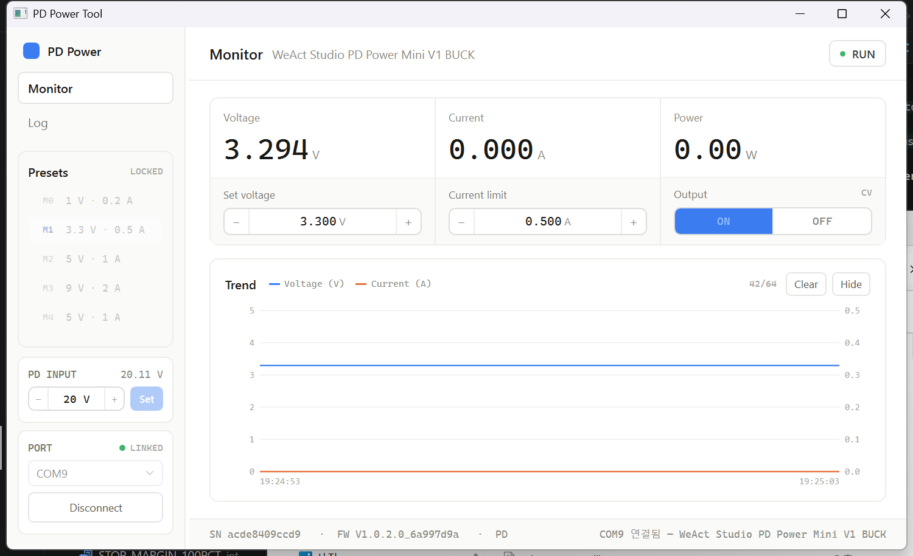
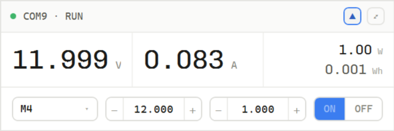

# WeactPD_PowerV1 — WeAct PD Power Mini V1 (Buck) PC 제어 프로그램

**한국어** (이 문서) · [English](README.en.md)

[WeAct Studio PD Power Mini V1 BUCK](https://github.com/WeActStudio/WeActStudio.PDPowerMiniV1-Buck)
장치를 PC에서 제어/모니터링하는 **Windows C# (WPF, .NET 8)** 데스크톱 애플리케이션.

## 1. 개요

| 항목 | 내용 |
|---|---|
| 대상 장치 | WeAct PD Power Mini V1 BUCK (출력 1–20 V / 0.05–3 A) |
| 통신 | USB CDC 가상 시리얼 (기본) / UART (3.3 V, CRC8) — `System.IO.Ports` |
| 디자인 원본 | [`GUI/design/`](GUI/design/) (HTML 목업 + C# 스펙) — 제조사 예제 툴이 아니라 자체 디자인 |
| 프로토콜 원본 | [`docs/protocol/`](docs/protocol/) (제조사 xlsx 2종 + Python 예제) |
| AI 제어 | 내장 MCP 서버 — Setup 에서 켜면 Claude 등 AI 가 장치를 읽고 제어 (§4) |
| 라이선스 | [MIT](LICENSE) (내장 Chivo Mono 폰트는 OFL 1.1) |

읽기·쓰기 명령 전부와 MCP 도구 10종을 실장비(COM9, 펌웨어 `V1.0.2.0_6a997d9a`)로 검증했다.
아래 실측 수치(§9–11)도 모두 이 장비 기준.

## 2. 통신 프로토콜 요약

- 명령 1바이트가 프레임 선두, **읽기 명령은 `0x80` 을 OR** (쓰기 `0x04` → 읽기 `0x84`).
- **USB CDC**: 종단 `0x0A`. **UART**: 종단 대신 CRC8 (다항식 `0x31`, 초기값 `0xFF`, MSB-first).
- 멀티바이트는 **리틀 엔디언**. 응답도 같은 구조 `[cmd|0x80][payload...][0x0A|crc8]`.
- 문자열 응답은 CDC `[cmd][ascii...][0x0A]`, UART `[cmd][len][ascii...][crc8]`.

### 2.1 쓰기 명령 (PC → 장치)

| 명령 | Head | 페이로드 | 비고 |
|---|---|---|---|
| OUTPUT_EN | `0x02` | `x` | **`1=enable`** (실측 확정 — xlsx 의 `0=enable` 주석은 오류, §8) |
| OUTPUT_ID | `0x03` | `x` | 프리셋 M0–M4 (0–4) |
| OUTPUT_DATA | `0x04` | `id, v_l8, v_h8, i_l8, i_h8` | 전압 mV, 전류 mA |
| OUTPUT_OCP_EN | `0x06` | `x` | 과전류 보호 |
| OUTPUT_OFFSET_EN | `0x07` | `x` | 오프셋 보정 |
| BRIGHTNESS | `0x08` | `x` | 1–100 |
| OUTPUT_DISCHARGE_EN | `0x09` | `x` | 방전 기능 |
| INPUT_PD_VOLTAGE | `0x0A` | `v_l8, v_h8` | 0.1 V 단위, ≥8 V. 출력 OFF & Vout<5 V 일 때만 적용 |
| SYSTEM_RESET | `0x40` | — | |
| SYSTEM_CONFIG_SAVE | `0x44` | — | 아래 6가지를 한 번에 플래시 저장 |
| SYSTEM_FACTORY_RESET | `0x45` | — | |

쓰기 값은 전부 **휘발성** — `SYSTEM_CONFIG_SAVE`(0x44, GUI 의 Save 버튼) 없이는 전원 재인가 시
소실된다. 저장 대상은 `OUTPUT_ID`·`OUTPUT_DATA`·`OCP_EN`·`OFFSET_EN`·`BRIGHTNESS`·
`INPUT_PD_VOLTAGE` 6가지(개별 선택 불가). 예외:

- `OUTPUT_EN` — 저장 안 됨. 재인가 시 항상 OFF (안전 동작).
- `OUTPUT_DISCHARGE_EN` — 휘발성인데 저장 목록에도 없어 **영구 설정 불가**.
- `SYSTEM_LCD_PANEL_TYPE`(`0x46`) — 반대로 **비휘발성**, 즉시 기록.

플래시를 되읽는 명령은 없다(읽기는 항상 RAM 값). 그래서 GUI 의 `UNSAVED` 는
**연결 이후 앱이 만든 변경만** 추적한다 — 장치 노브로 바꾼 값은 알 수 없다.

### 2.2 읽기 명령 (PC → 장치 → 응답)

| 명령 | Head | 응답 페이로드 | 비고 |
|---|---|---|---|
| WHO_AM_I | `0x81` | `info(ascii)` | 장치명 |
| READ_OUTPUT_STATE | `0x82` | `x` | bit0: output en, bit2-1: 01=CC, 10=OC, 00=CV |
| READ_OUTPUT_ID | `0x83` | `x` | 현재 프리셋 ID |
| READ_OUTPUT_DATA | `0x84` | `id, v_l8, v_h8, i_l8, i_h8` | 요청에 `id` 1바이트 포함 |
| READ_OUTPUT_DISPLAY | `0x85` | `v_l8, v_h8, i_l8, i_h8` | **실측** 전압/전류 — 폴링용 |
| READ_OUTPUT_OCP_EN | `0x86` | `x` | |
| READ_OUTPUT_OFFSET_EN | `0x87` | `x` | |
| READ_BRIGHTNESS | `0x88` | `x` | |
| READ_INPUT_STATE | `0x8A` | `state, v_l8, v_h8, pv_l8, pv_h8` | v=입력전압(mV), pv=PD요청(0.1 V). 펌웨어 v1.0.2.0+ |
| READ_SYSTEM_VERSION | `0xC2` | `version(ascii)` | |
| READ_SYSTEM_SERIAL_NUM | `0xC3` | `serial(ascii)` | |

**INPUT_STATE 코드**: 0=WAIT, 1=WAIT_PD_OK, 2=WAIT_QC_OK, 3=ERR, 4=QC, 5=PD, 6=DC

### 2.3 CRC8 (UART 전용)

```csharp
public static byte Crc8(ReadOnlySpan<byte> data)
{
    byte crc = 0xFF;
    foreach (byte b in data)
    {
        crc ^= b;
        for (int i = 0; i < 8; i++)
            crc = (byte)((crc & 0x80) != 0 ? (crc << 1) ^ 0x31 : crc << 1);
    }
    return crc;
}
```

## 3. GUI



- 창 1000×680, 좌측 레일 + 우측 메인. 레일: Monitor/Setup/Log 내비, 프리셋 M0–M4,
  PD INPUT, PORT 카드. 메인: 측정 3열 + 스테퍼·ON│OFF·CV/CC 배지, Trend 차트, 푸터.
- 측정 셀은 단어 라벨 대신 **V / A 약어** + 대형 숫자(58px, 내장 Chivo Mono —
  목업 68px 은 6글자("11.999")가 셀 폭을 넘어 58px 로 고정). 셋째 셀은 전력(W)과
  **누적 전력량(Wh)** 2단 — 값 옆 단위가 종류를 말하므로 별도 라벨 없음. Wh 는 폴링마다
  `V×A×Δt` 적분, `RST` 로 초기화(Trend 히스토리는 유지), MCP `get_status` 의
  `energyWh` 로도 노출.
- 스테퍼는 휠 ±1 / Ctrl+휠 ±0.1, 변경 즉시 장치 반영.
- 치수·색상의 근거는 [`GUI/design/`](GUI/design/) 의 HTML 목업이다.
  **요약 스펙만 보고 구현하면 구조가 틀어진다 — 반드시 목업을 렌더링해서 볼 것.**
- WPF 기본 컨트롤 크롬은 디자인과 섞이면 촌스러워서 `Themes/Theme.xaml` 에서 템플릿을 전부
  교체했다. 색이 바뀌는 버튼은 템플릿이 `Background`/`BorderBrush` 를 `TemplateBinding` 으로
  받아야 하고(하드코딩하면 호출부 `DataTrigger` 가 무력화된다), 호버는 투명도로 표현한다.

### Trend

| 기능 | 동작 |
|---|---|
| `1m` `5m` `1h` | 표시 구간 — 저장 간격이 따라 조정 (§9) |
| `Auto` / `Fit` | Y축 0–피크 / 데이터 범위 맞춤 (리플 관찰용) |
| **그래프 클릭** | 정지/재생 토글 — 정지는 잘라낸 창(`MeasurementWindow`)을 붙잡는 방식이라 폴링은 계속된다 |
| **축 위 휠** | Y축 수동 줌 — 왼쪽 절반 전압축, 오른쪽 절반 전류축. `Auto`/`Fit` 으로 복귀 |
| `CSV` | 보이는 구간 내보내기 (`timestamp,volts,amps,watts,regulation,output_enabled`) |
| 커서 / 상태 띠 / 통계 | 가장 가까운 샘플 읽기, CV/CC/OC·출력 시간 띠, 구간 min/avg/max |

차트([`TrendChart.cs`](src/PdPower.App/Controls/TrendChart.cs))는 직접 렌더링한다.
x축은 시각이고, 점이 픽셀보다 많으면 **픽셀 열마다 min/max 를 그린다** — 균등 샘플링은
전원 파형에서 정작 보고 싶은 스파이크를 지워버린다. 정지·수동 상태는 플롯 안 배지로 표시.

### 미니 모드



헤더의 **Mini** 버튼으로 본창을 숨기고 440px 항상-위 위젯으로 전환한다
([`MiniWindow.xaml`](src/PdPower.App/MiniWindow.xaml), 목업 2b). 같은 ViewModel 을 쓰므로
폴링·MCP 서버·상태가 그대로 이어진다.

- 헤더: 연결 점 + `포트 · RUN/IDLE/OFFLINE`, **핀**(항상 위 토글), **⤢**(전체 창 복귀).
  헤더 드래그로 이동, 모서리는 DWM 라운드(Win11)
- 1단: V/A 30px + W·Wh 우측 2단 — 단위는 숫자와 베이스라인 정렬(한 TextBlock 의 Run)
- 2단: 프리셋 드롭다운(출력 중 잠금), V/I 미니 스테퍼(휠 ±1 / Ctrl+휠 ±0.1), ON│OFF
- 프리셋 팝업은 `PlacementTarget` 상대 배치 대신 **PointToScreen 절대좌표**로 연다 —
  혼합 DPI 멀티모니터에서 엉뚱한 모니터에 뜨는 WPF 버그 회피

## 4. AI 제어 — 내장 MCP 서버

Setup 의 **AI control server** 를 켜면 앱 안에서 MCP 서버가 떠서 Claude 같은 AI 가 장치를
읽고 제어할 수 있다. COM 포트는 한 프로세스만 잡을 수 있으므로 **서버는 포트를 쥔 GUI
프로세스 안에 산다.** 공식 SDK
([`ModelContextProtocol.AspNetCore`](https://www.nuget.org/packages/ModelContextProtocol.AspNetCore))
의 Streamable HTTP, `http://localhost:5115`, localhost 전용, 기본 꺼짐.

등록은 Setup 의 **Copy register cmd** 버튼으로 아래 명령을 복사해 붙여넣으면 된다:

```bash
claude mcp add --transport http pdpower http://localhost:5115
```

| 도구 | 동작 |
|---|---|
| `get_status` | 연결·출력·CV/CC/OC·실측 V/A/W·누적 Wh·입력(PD)·활성 프리셋 |
| `get_settings` | 프리셋 M0–M4, OCP, 밝기, PD 전압 — **장치에서 되읽어 노브 변경도 반영** |
| `get_history_stats` | Trend 구간의 V/A/W min/avg/max |
| `get_history_samples` | Trend 구간의 시계열 샘플 (균등 데시메이션, 최대 2000점) — 파형 분석용 |
| `set_output` / `set_setpoint` | 출력 on/off, 전압/전류 (한쪽만 지정 가능) |
| `select_preset` / `set_pd_voltage` | **출력 중 거부** (GUI 와 같은 규칙) |
| `set_ocp` / `set_brightness` / `save_config` | Setup 항목과 동일 |
| `reset_device` | 장치 재부팅(0x40) — **출력 중 거부**, 자동 재접속과 짝 (§10) |

제어 요청은 UI 스레드로 마샬링해 **GUI 버튼과 같은 코드 경로**를 타고(화면·UNSAVED 동기),
모든 AI 명령은 Log 에 `[MCP]` 로 남는다. Setup 의 **AI 읽기 전용** 체크를 켜면 제어 도구
전부가 거부된다. 서버 on/off 와 읽기 전용 상태는 저장되어 재시작 시 복원된다.
도구 12종 실기기 검증 완료 (2026-08-04).

SDK 2.0 주의: ① nullable 파라미터도 **기본값 `= null` 이 있어야** 스키마에서 선택 인자가 된다
② 도구 예외는 `McpException` 이어야 클라이언트가 메시지를 본다 ③ `Microsoft.AspNetCore.App`
프레임워크 참조가 전이되어 framework-dependent 배포본은 **ASP.NET Core Runtime 도 필요**.

## 5. 솔루션 구조

```
WeactPD_PowerV1/
├─ Directory.Build.props          ← 공유 버전 (VersionPrefix)
├─ .githooks/pre-commit           ← 커밋마다 패치 버전 증가
├─ .github/workflows/build.yml    ← 빌드·테스트, 태그 시 Release 배포
├─ docs/protocol/                 ← 제조사 프로토콜 원본
├─ GUI/design/ · GUI/icon/        ← 디자인 목업 · 앱 아이콘 원본
├─ src/
│  ├─ PdPower.Core/               ← 프로토콜 라이브러리 (Frame, Crc8, PdPowerDevice,
│  │                                 MeasurementHistory — 시간 기준 링 버퍼)
│  ├─ PdPower.Cli/                ← 실장비 검증 콘솔 (selftest/bench/test-ocp 등)
│  ├─ PdPower.Mcp/                ← MCP 도구 10종 + localhost:5115 Kestrel 호스트
│  └─ PdPower.App/                ← WPF GUI (Theme.xaml 템플릿, TrendChart,
│                                    MainViewModel + MainViewModel.Mcp.cs)
└─ tests/PdPower.Core.Tests/      ← xUnit 63개
```

창 위치 저장은 WPF DIP 가 아니라 **Win32 좌표**로 다룬다 — 시스템 DPI 기준으로 자체
일관되어 배율이 다른 모니터 사이에서도 같은 자리로 돌아온다.

> PerMonitorV2 전환을 시도했다가 되돌렸다: 96 DPI 모니터에서 창이 물리적으로 확 작아져
> 대형 숫자가 잘리고 그래프가 눌리는 부작용이 실사용을 깨뜨렸다. 다시 시도하려면
> 창 기본 크기·최소 크기·서체 크기를 모니터 배율별로 함께 재설계해야 한다.

### 버전 · 릴리스

버전은 `Directory.Build.props` 의 `VersionPrefix` 하나. 클론 후 한 번:

```bash
git config core.hooksPath .githooks
```

이후 커밋마다 패치 버전이 자동으로 올라간다 (`SKIP_VERSION_BUMP=1` 로 생략,
머지·리베이스 중엔 자동 제외). CI 가 최종 버전을 결정한다:
`master` 푸시는 `<prefix>-dev.<run>` 아티팩트, **태그 `v1.2.3` 푸시는 GitHub Release 자동 생성**
(퍼블리시 전에 테스트를 돌리므로 테스트가 깨지면 릴리스도 없다):

```bash
git tag v0.2.0 && git push origin v0.2.0
```

| 릴리스 파일 | 내용 |
|---|---|
| `PdPowerTool.exe` | GUI 단일 exe — .NET 8 Desktop + ASP.NET Core Runtime 필요 |
| `PdPowerTool-standalone.exe` | GUI, 런타임 포함 |
| `PdPowerCli.exe` / `PdPowerCli-standalone.exe` | CLI (전자는 .NET 8 Runtime 필요) |

### 빌드 · 실행

```bash
dotnet build WeactPD_PowerV1.sln
dotnet test
dotnet run --project src/PdPower.Cli -- --port COM9 selftest   # 실장비 확인 (읽기 전용)
dotnet run --project src/PdPower.App
```

### 구현 시 주의점

- 응답은 `Frame.ResponseLength()` 고정 길이로 자른다. **0x0A 탐색만으로는 프레임을 못 나눈다**
  — 페이로드에 0x0A 가 들어갈 수 있다 (예: 2570 mV = `0x0A0A`). ASCII 응답만 종단 탐색.
- 요청 직전 `DiscardInBuffer` 로 프레임 동기를 잡는다.
- `FrameExchanged` 이벤트는 스레드 풀에서 온다 — UI 컬렉션은 디스패처로 마샬링.
- 슬라이더류는 디바운스 필수 (밝기는 250 ms 모아 한 번만 쓰고, 되읽을 땐 억제 플래그).
- `READ_INPUT_STATE` 는 펌웨어 v1.0.2.0+ — 실패를 정상 흐름으로 처리.

## 6. 로드맵

완료: 프로토콜 라이브러리(+테스트 63), CLI, 목업 충실 GUI(백그라운드 폴링·Trend 계측·Setup·
자동 재접속 실검증·미니 모드), MCP 서버(12종 + 읽기 전용), 아이콘,
버전/릴리스 자동화, 앱 설정 저장(`%AppData%\PdPowerTool\settings.json` — 마지막 포트,
MCP on/읽기전용, 측정 주기, 상태 배수, Trend 범위, 창 위치/크기(물리 px), 미니 위치/모드).

남은 것:

- [ ] Setup: 오프셋 보정, 방전(읽기 명령 없음), 공장 초기화(`0xC7` 교정값 백업 먼저)
      — 재부팅은 MCP `reset_device` 로 제공됨
- [ ] SYSTEM_FACTORY_DATA(0x47) 캘리브레이션 읽기/쓰기
- [ ] 레일 접힘 모드, 프리셋 인라인 편집
- [ ] 트리거 버스트 캡처 (상시 10 ms 폴링의 CPU 29 % 를 피하면서 트립 파형 잡기)
- [ ] 전력(W) 시리즈, 설치본 패키징

## 7. 참고 링크

- 제조사 저장소: <https://github.com/WeActStudio/WeActStudio.PDPowerMiniV1-Buck>
- 프로토콜 Python 예제: [`docs/protocol/com_pdpower.py`](docs/protocol/com_pdpower.py)

## 8. 주의 사항

- `INPUT_PD_VOLTAGE` 변경은 **출력 OFF + Vout 5 V 미만**일 때만 적용.
- 3 A 연속 출력은 방열 보강 필요 (2 A까지는 상시 가능).
- **`*_EN` 계열은 `1=enable`** — xlsx 의 `0=enable` 주석 4개는 전부 오류다
  (벤더 README·Python 예제·COM9 실측 모두 `1=enable`).
- 쓰기 값은 휘발성 — `SYSTEM_CONFIG_SAVE` 없이는 재인가 시 소실.
- UART 직결은 3.3 V 레벨, 외부 UART 칩은 역전류 보호 필요.

## 9. 폴링 성능 실측 (COM9, `PdPower.Cli bench 300`)

| 명령 | 최소 | 평균 | p95 | 최대 |
|---|---|---|---|---|
| `READ_OUTPUT_DISPLAY` `0x85` | 0.14 | 0.23 | 0.30 | 0.67 |
| `READ_OUTPUT_STATE` `0x82` | 0.15 | 0.31 | 0.30 | 26.09 |
| `READ_INPUT_STATE` `0x8A` | 0.16 | 0.29 | 0.31 | 17.67 |
| **폴링 1주기 합계 (ms)** | **0.48** | **0.83** | **0.85** | **26.58** |

250 ms 주기 점유율 0.3 % — 전송은 병목이 아니다 (CDC 데이터 엔드포인트는 벌크라 서브밀리초).
실제 제약은 ① 장치 표시값 갱신이 ~10 ms 라 그 아래로는 새 데이터가 없고
② 드물게 20–30 ms 지연이 튀며 ③ 프레임 트레이스를 켜면 주기가 15배 늘어난다는 것.

구조: 수집은 `PeriodicTimer` 백그라운드 루프(UI 무접촉), 화면 반영과 차트 렌더는 60 ms 로
묶는다. 측정(`0x85`)은 매 틱, 상태·입력은 설정한 배수마다 — OCP 트립(약 200 ms)의 CC→OC
전이를 보려면 상태 실효 주기를 200 ms 아래로. 실측 CPU(한 코어): 250 ms 폴링 2.2 %,
10 ms 폴링 29.1 % (UI 는 양쪽 다 정상 — 비용 대부분은 `TransactAsync` 의 `Task.Run`).

Trend 히스토리는 링 버퍼 14,400점, **저장 간격 = 창 길이 / 14,400** (1m→4 ms, 5m→21 ms,
1h→250 ms). 짧은 창은 폴링 그대로 다 담기고 긴 창은 알아서 드물게 저장된다.
1h 를 막 선택하면 오른쪽만 채워진 거의 빈 그래프인 게 정상.

## 10. 재접속 대기 (USB 단절 복구)

폴링 중 통신이 실패하면 같은 포트로 돌아오기를 **1초 × 60회** 기다린다. 포트가 열거에
다시 나타난 뒤 `WHO_AM_I` 성공까지 재시도하고, **시리얼 번호가 다르면**(같은 포트에 다른
장치) 자동 재접속을 중단한다. 성공하면 프리셋·OCP·밝기를 다시 읽는다 — 재부팅이었다면
휘발성 값이 플래시 값으로 돌아가 있기 때문. 대기 중 상태 칩은 `RECONNECT`, Trend 히스토리는
유지되며 `Disconnect` 로 취소한다.

**실검증 완료 (2026-08-04)**: MCP `reset_device`(0x40) 로 장치를 재부팅시켜 CDC 포트
소멸→복귀를 재현 — 상태 칩이 `RECONNECT` 로 바뀌었다가 같은 시리얼로 자동 재접속하는
전체 경로를 확인했다.

## 11. OCP 실측 (12 V, 약 21 Ω 부하, `test-ocp 12.0 0.2`)

| | OCP OFF | OCP ON |
|---|---|---|
| 결과 | CC 물림, **출력 유지** | **220 ms 에 차단** |
| 정상상태 | 4.15 V / 0.200 A (제한값에 정확히 물림) | 도달 못 함 |
| 최종 상태 | `ON` / `ConstantCurrent` | `OFF` / `OverCurrent` |

문서에 없는 실측 사실: ① **OC 는 래치** — 출력을 다시 켜야 지워진다.
② 트립 타이머는 표시 전류가 아니라 **CC 진입 시점** 기준 — 과부하면 표시 전류가 설정값에
도달하기 전에 트립한다. ③ 출력 전압 램프가 느리다 (CC 물림 → 정상상태 약 640 ms).

함의: 과부하 + OCP ON 은 저전압 펄스 후 꺼지며, 250 ms 폴링은 CC 구간을 놓치고 래치된
`OFF`/`OC` 만 보게 될 수 있다 — 트립 원인을 보려면 폴링을 빠르게 할 것.
